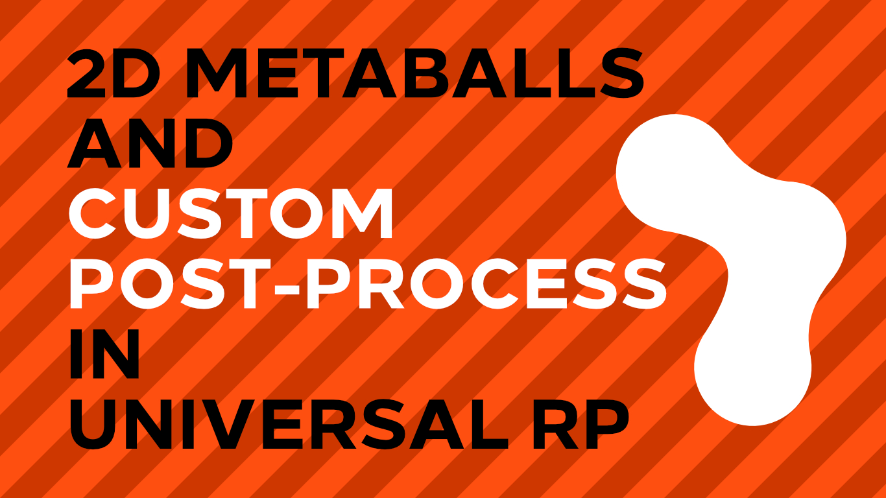

# Metaballs in Unity URP

A metaball simulation for Unity in Universal Render Pipeline.

## Overview

This project contains a metaball simulation in 2D which uses a custom post-processing effect to render the metaballs.

## Software

This project was created using Unity 2019.3.0f6 and Universal Render Pipeline 7.1.8.

## Authors

This project and the corresponding tutorial series were written by Daniel Ilett. [Follow him on Twitter](https://twitter.com/daniel_ilett) for more gamedev tutorials!

## Release

This project has not yet released. Stay tuned for more information!
